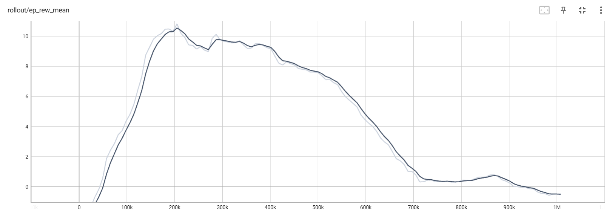
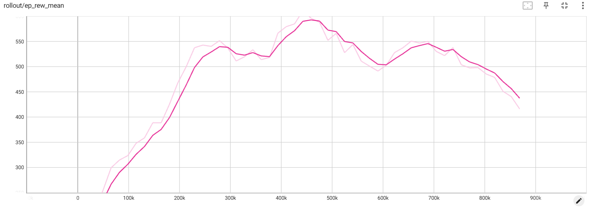
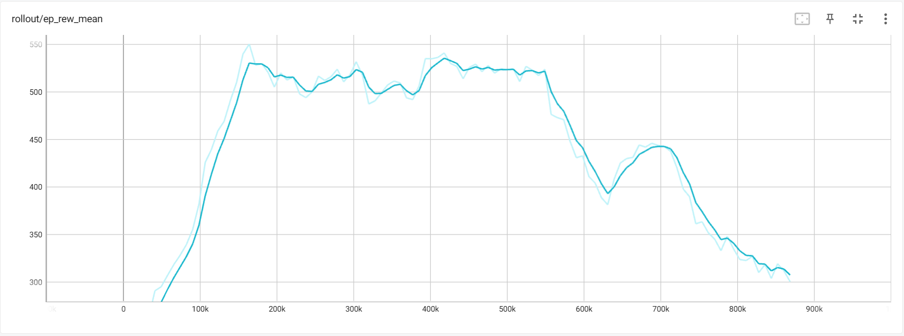
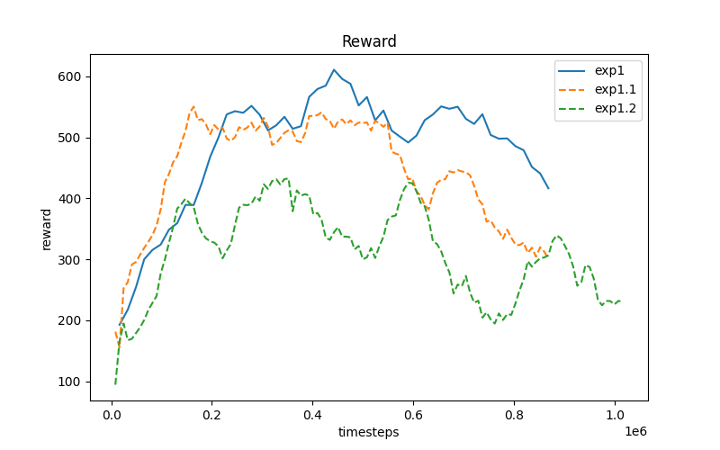

# 强化学习 机器人视觉导航
## 1. 任务描述
在固定环境内，根据第一视角图像输入，找到指定目标。

状态：第一视角图像，尺寸为128x128

动作：机器人横向速度、纵向速度和旋转角速度

奖励：机器人到达指定位置会返回+10奖励，在`envs/SingleAgent/mine_toy.py`中设置了一种简易稠密奖励方式。

对环境的测试可以参考`envs/SingleAgent/mine_toy.py`文件。

## 2. 训练
安装'hydra'和'Omegacfg'来配置实验参数。
``` 
pip install hydra-core --upgrade
```
原训练：
```
python train_ppo.py
```
默认参数配置在`cfg/EpMineEnvCfg.yaml`中。
使用默认参数训练（PPO baseline）：
```
python train.py 
```
可在命令行中修改`.yaml`中已有的参数：
```
python train.py env.only_image=False train.algo=sac train.n_timesteps=1500000
```
训练结果、配置文件、模型等均会保存在`\runs`路径下。

检查训练结果，需要指定使用的算法，给出模型路径：
```
python play.py --algo ppo --save_path runs\\RobotCv_ppo_21-12-34-08\\RobotCv_ppo.zip
```

## 3. RL Env设置
### 3.1 观测空间
我们仅用机器人视觉信号作为观测输入。
即 `only_img=True`，`only_state=False`。

### 3.2 动作空间


### 3.3 奖励函数
原文提供了稀疏奖励函数（任务成功+10），由于纯稀疏奖励效果较差，本实验未使用纯稀疏奖励。  
在我们的项目中，定义了两个稠密奖励：
- **v0**: 即原稠密奖励函数。计算机器人到目标矿石的距离，并进一步计算机器人到目标矿石的移动速度。以速度作为奖励。
    ```python
        def get_dist_reward_v0(self,results):
            # 到目标的距离奖励
            current_dist = self.get_dist_to_mine(reuslts=results)
            # print(self.last_dist - current_dist)
            dist_reward = (self.last_dist - current_dist) 
            self.last_dist = current_dist
            return dist_reward
    ```
由于速度值较小，该奖励数值也较小。为了提高训练稳定性，我们希望对奖励进行缩放（reward scaling），减小其方差。然而该速度值太小，经尝试，缩放效果不好。

于是，设计新的奖励函数，惩罚机器人到矿石的距离，不再计算速度。并进行缩放。
- **v1**: 
    ```python
        def get_dist_reward_v1(self,results):
            # 负距离表示
            current_dist = self.get_dist_to_mine(reuslts=results)
            # print(self.last_dist - current_dist)
            dist_reward = (- current_dist) 
            self.last_dist = current_dist

            if self.reward_scaling:
                dist_reward = (dist_reward+3)/3
            return dist_reward
    ```
该奖励函数可在配置文件`.yaml`中更改。

### 3.4 强化学习算法
PPO SAC

### 3.5 网络设置
给出两种Policy：
- **CnnPolicy**: 这是stable-baselines3给出的带有卷积网络的默认策略。其结构为：
    ```
    ActorCriticCnnPolicy(
    (features_extractor): NatureCNN(
        (cnn): Sequential(
        (0): Conv2d(3, 32, kernel_size=(8, 8), stride=(4, 4))
        (1): ReLU()
        (2): Conv2d(32, 64, kernel_size=(4, 4), stride=(2, 2))
        (3): ReLU()
        (4): Conv2d(64, 64, kernel_size=(3, 3), stride=(1, 1))
        (5): ReLU()
        (6): Flatten(start_dim=1, end_dim=-1)
        )
        (linear): Sequential(
        (0): Linear(in_features=9216, out_features=512, bias=True)
        (1): ReLU()
        )
    )
    (mlp_extractor): MlpExtractor(
        (shared_net): Sequential()
        (policy_net): Sequential()
        (value_net): Sequential()
    )
    (action_net): Linear(in_features=512, out_features=3, bias=True)
    (value_net): Linear(in_features=512, out_features=1, bias=True)
    )
    ```
    然而，由于观测空间仅有视觉输入，缺乏机器人速度、加速度、全局位置等信息，导致任务信息缺失（POMDP）。我们在后续实验中使用LSTM处理特征，从而提供更全面的时序信息。
- **CnnLstmPolicy**: 使用的是`sb3-contrib`库中的`RecurrentPPO`进行训练，其`CnnLstmPolicy`结构如下：
  ```
    RecurrentActorCriticCnnPolicy(
    (features_extractor): NatureCNN(
        (cnn): Sequential(
        (0): Conv2d(3, 32, kernel_size=(8, 8), stride=(4, 4))     
        (1): ReLU()
        (2): Conv2d(32, 64, kernel_size=(4, 4), stride=(2, 2))    
        (3): ReLU()
        (4): Conv2d(64, 64, kernel_size=(3, 3), stride=(1, 1))    
        (5): ReLU()
        (6): Flatten(start_dim=1, end_dim=-1)
        )
        (linear): Sequential(
        (0): Linear(in_features=9216, out_features=512, bias=True)
        (1): ReLU()
        )
    )
    (pi_features_extractor): NatureCNN(
        (cnn): Sequential(
        (0): Conv2d(3, 32, kernel_size=(8, 8), stride=(4, 4))
        (1): ReLU()
        (2): Conv2d(32, 64, kernel_size=(4, 4), stride=(2, 2))
        (3): ReLU()
        (4): Conv2d(64, 64, kernel_size=(3, 3), stride=(1, 1))
        (5): ReLU()
        (6): Flatten(start_dim=1, end_dim=-1)
        )
        (linear): Sequential(
        (0): Linear(in_features=9216, out_features=512, bias=True)
        (1): ReLU()
        )
    )
    (vf_features_extractor): NatureCNN(
        (cnn): Sequential(
        (0): Conv2d(3, 32, kernel_size=(8, 8), stride=(4, 4))
        (1): ReLU()
        (2): Conv2d(32, 64, kernel_size=(4, 4), stride=(2, 2))
        (3): ReLU()
        (4): Conv2d(64, 64, kernel_size=(3, 3), stride=(1, 1))
        (5): ReLU()
        (6): Flatten(start_dim=1, end_dim=-1)
        )
        (linear): Sequential(
        (0): Linear(in_features=9216, out_features=512, bias=True)
        (1): ReLU()
        )
    )
    (mlp_extractor): MlpExtractor(
        (policy_net): Sequential()
        (value_net): Sequential()
    )
    (action_net): Linear(in_features=256, out_features=3, bias=True)
    (value_net): Linear(in_features=256, out_features=1, bias=True)
    (lstm_actor): LSTM(512, 256)
    (lstm_critic): LSTM(512, 256)
    )
  ```

## 4. 实验设置及结果

### 4.1 Exp0：Baseline
PPO + 奖励函数v0 + CnnPolicy
即完全默认的设置。稀疏奖励得到的结果更差，因此不再展示。奖励函数v0即为上文说明的默认密集奖励。
Exp0训练Reward曲线如下：



效果比较差，在训练途中完全崩溃。
使用训练得到的模型控制机器人，轨迹为：
<p align="center">
    
    
</p>
机器人似乎没学到任何策略，基本不进行运动。


### 4.2 Exp1：更改奖励函数

- **EXP1:** PPO + 奖励函数v1 + CnnPolicy
  ```
  python train.py train.algo=ppo env.reward_scaling=true env.dist_reward=v1 
  ```
  训练曲线：
  

  结果： 
  <p align="center">
    
    
    </p>
    控制效果相对比较好，运动稳定连贯，但是由于没加朝向判定，容易在目标点附近绕圈。右图得到的结果相对出色。
- **EXP1.1:** PPO + 奖励函数v1 + CnnPolicy +    ent_coef=0.1
  ```
  python train.py train.algo=ppo env.reward_scaling=true env.dist_reward=v1 train.ent_coef=0.1
  ```
    ent_coef表示loss中的熵系数，用于鼓励模型探索。然而，相比于EXP1，EXP1.1在训练后期可能由于过度探索而导致训练严重不稳定。
  训练曲线：

  
  结果：  
  <p align="center">
    
    
    </p>    
    整体来看有向中心运动的趋势，但轨迹非常混乱，控制不稳定。右图的起始点离目标点很近，却又向墙角绕了一大圈。

- **EXP1.1:** PPO + 奖励函数v1 + CnnPolicy +    target_kl=1.5

    target_kl（目标KL散度）是一个重要的超参数，用于控制策略更新过程中的步长。它的主要作用是防止策略更新过度，从而保持训练的稳定性。target_kl用于设定期望的KL散度（Kullback-Leibler散度）值，衡量新旧策略之间的差异。如果策略更新导致的KL散度超过了这个目标值，训练过程会采取措施进行调整，例如提前停止当前批次的优化或者缩小步长。

    我们希望通过引入该参数，来减小训练过程中出现的不稳定现象（如reward曲线明显下跌）。target_kl的调参比较困难，经过预试验，选择`target_kl=1.5`。
    ```
    python train.py train.algo=ppo env.reward_scaling=true env.dist_reward=v1 train.target_kl=1.5
    ```
     
    <p align="center">
    
    
    </p> 
    然而，结果并不如预期，训练效果反而更差。从演示结果来看，智能体似乎最终并没有学到任何有用的策略。只是在盲目地撞墙，甚至并没有向中心移动的趋势。


### 4.3 Exp2: LSTM
PPO + 修改后奖励函数v1 + CnnLstmPolicy
```
python train.py train.algo=ppo env.reward_scaling=true env.dist_reward=v1 train.policy=CnnLstmPolicy
```
(还没跑，可能还有2.1，使用奖励函数v0测试一下)

